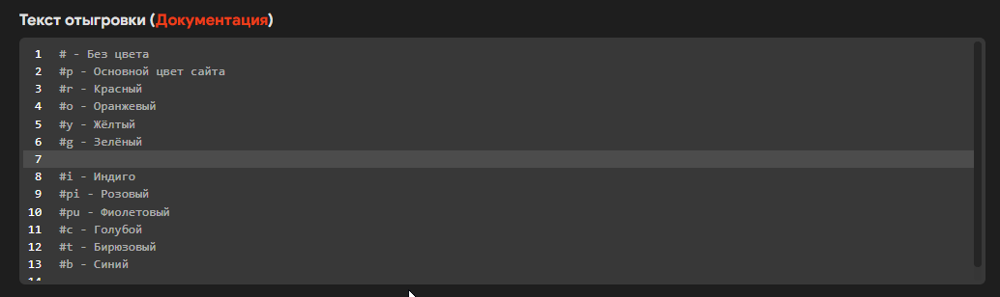
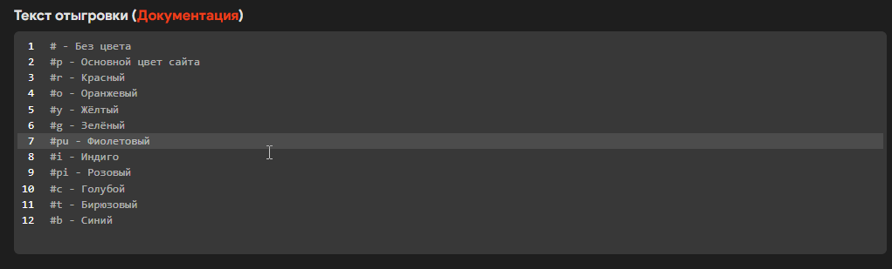
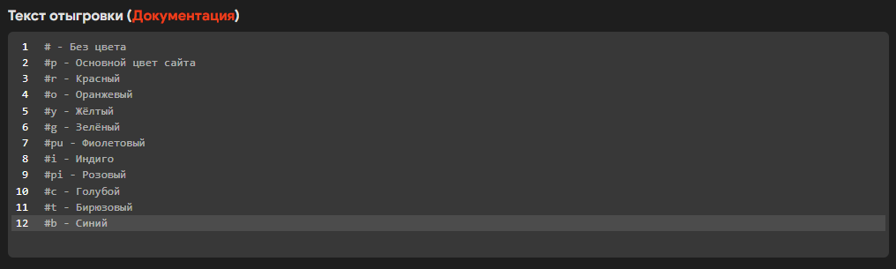

# ✍ Отыгровки

В редакторе отыгровок так же применяются понятия из [gen.md](gen.md "mention")

## Понятия

### Описание&#x20;

Оставьте поле пустым или расскажите в каких случаях может пригодиться отыгровка.

### Текст

Основное содержание отыгровки. Ниже указаны синтаксис разметки и примеры.


Название, к какому типу принадлежит отыгровка и текст отыгровки являются обязательными для заполнения!


## Горячие клавиши

Помимо основных  горячих клавиш на подобии отмены действия (Ctrl+Z), вырезания (Ctrl+X), копирования (Ctrl+C), вставки (Ctrl+V) имеются и другие.

#### Alt + Стрелки влево/вправо

Передвижение указателя в конец или начало строки.

#### Ctrl + Стрелки влево/вправо

Передвижение указателя через слово.

#### Alt + Стрелки вниз/вверх

<figure><figcaption><p>Передвижение строки вверх и вниз</p></figcaption></figure>

#### Ctrl + Home/End

<figure><figcaption><p>Перейти в начало или конец текста</p></figcaption></figure>

#### Crtl + Alt + Клики левой кнопки мыши по нужным местам

<figure><figcaption><p>Одновременное редактирование</p></figcaption></figure>


Указаны горячие клавиши, которые чаще всего могут понадобиться в работе.


## Синтаксис контента отыгровки

**Одна строка - одна команда**. Иногда из-за длинны отыгровка может быть перенесена на другую строку автоматически. В таком случае это не считается за новую строку.

### Комментарии

Комментарии невозможно скопировать с помощью клика по строке. Они служат для дополнительной информации к последующей отыгровке.

Комментарии начинаются с **#**, после них идёт текст, **отделённый пробелом**, который вы хотите донести до пользователя.

Комментарии так же можно раскрасить в различные цвета, достаточно указать код цвета после **#**

```
# Обычный комментарий (серый)
#r Красный комментарий
#p Комментарий с основным цветом сайта
```

<details>

<summary>Цвета комментариев</summary>

* r - Красный (Для плохого исхода)
* g - Зелёный (Для хорошего исхода)
* y - Жёлтый
* p - Основной цвет сайта (Для любого случая)
* pi - Розовый
* i - Индиго
* c - Голубой
* t - Бирюзовый
* o - Оранжевый
* pu - Фиолетовый
* b - Синий

Хотите добавить ещё цвет? Напишите разработчику

</details>


Необходимо отделять # с цветовым кодом отдельно от основного комментария пробелом (смотрите  примеры выше).


### Действия

Всё, что не является комментарием, является действием. Действие в отличие от комментария можно скопировать.

```
say Привет, Олег!
me пожа{g1} руку Олегу
```

Вы можете спросить: "Что за чудо-юдо в второй строке?". А это половое различие (странное название, не важно)!

### Половое различие

Это позволит персонажам с женским полом отыгрывать женские отыгровки.\
Не "пожал руку", а "пожала руку"! Хватит издеваться над женщинами.

Это по сути переменные, значения которых зависят от пола персонажа, указанном на сайте.

Необходимо понять, что это переменная, для этого используются **{}**, в которых указывается имя переменной.

<table><thead><tr><th width="124">Пол</th><th width="58">g1</th><th width="76">g2</th><th width="64">g3</th><th width="62">g4</th><th width="66">g5</th><th width="64">g6</th><th width="71">g7</th><th>g8</th></tr></thead><tbody><tr><td><strong>Мужской</strong></td><td>л</td><td>ёс</td><td>ил</td><td>р</td><td>к</td><td>ся</td><td>ёл</td><td>ёл</td></tr><tr><td><strong>Женский</strong></td><td>ла</td><td>есла</td><td>ила</td><td>рла</td><td>кла</td><td>ась</td><td>ла</td><td>ела</td></tr></tbody></table>

```
me полож{g3} конфету на стол
me взял{g6} за канат
```


Проверяйте совместимость переменных через предпросмотр.

