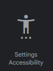

# 👁 Иконки

Для примера возьмём добавление иконки к типу отыгровки.

<figure><figcaption>
Внизу всегда указано, откуда можно их взять
</figcaption></figure>

Итак, вы перешли на сайт с иконками.

<figure><figcaption>
Вид сайта с иконками
</figcaption></figure>

Пролистав немного вниз вы можете обнаружить иконки, выберите ту, которая подойдёт к вашему контексту (вы так же можете блестнуть знаниями английского и воспользоваться поиском).

Итак, нам очень очень понравился вот этот человечек и мы хотим использовать его: 

У нас есть целых **2 способа** добавления.

**1 способ**. Все буквы снизу перевести в нижний регистр, а пробелы заменить на `_`. В нашем случае это будет settings\_accessibility. Вставляем в нужное поле и готово!

**2 способ**. Нажимаем на иконку, у нас справа вылезает панель. Сверху у неё есть 3 пункта: Web, Android, iOS. Выбираем Android, копируем и вставляем в нужное поле. Готово!

<figure><figcaption>
Копировать из подсвеченой зелёным области.
</figcaption></figure>

